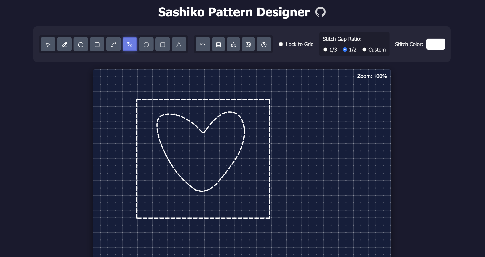

# Sashiko Pattern Designer

A modern web-based application for creating traditional Japanese Sashiko embroidery patterns using p5.js. Design intricate geometric patterns with intuitive drawing tools, advanced path editing, and grid-based precision.

## Why This Exists

As a visual person, I've always found it essential to draw out and visualize designs before executing them. Whether planning embroidery patterns, sketching layouts, or mapping out ideas, seeing the design come together digitally first helps me work through creative decisions before committing thread to fabric. This tool bridges the gap between initial concept and physical creation, letting you experiment freely with traditional Sashiko patterns in a flexible digital environment. Plan your stitches, test color combinations, and refine your designs until they're exactly right—then take your pattern to the real world with confidence.

**Note:** This began as a personal project and is very much a work in progress! I am sharing it freely in case others find it useful. If you find bugs or have ideas, feel free to open an issue or contribute.



## Features

### Drawing Tools
- **Line Tool** - Draw straight lines between two points with traditional dashed stitch rendering
- **Circle Tool** - Create perfect circles from center point to radius
- **Box Tool** - Draw rectangular patterns by defining opposite corners
- **Curve Tool** - Design smooth curved lines with interactive control points
- **Pen Tool** - Freehand drawing with sophisticated path smoothing algorithms

### Advanced Editing
- **Selection Mode** - Click any stitch to select and modify it
- **Control Point Dragging** - Visually adjust shapes by dragging yellow control points
- **Path Point Editing** - Fine-grained control over individual points in freehand paths
  - Delete points (Delete key) - Remove unwanted points while maintaining path integrity
  - Merge points (M key) - Smooth sharp corners by averaging adjacent points
- **Color Editing** - Real-time color updates via color picker
- **Undo System** - Step backward through up to 50 actions
- **Delete Function** - Remove selected stitches with Delete/Backspace key

### Grid & Snapping
- **Configurable Grid** - Adjust grid size from 10px to 50px
- **Lock to Grid** - Snap points to grid intersections for precise geometric patterns
- **Freehand Mode** - Disable snapping for organic, flowing designs
- **Toggle Visibility** - Show/hide grid overlay while maintaining snap functionality

### Visual Customization
- **Stitch Length Control** - Adjust dash length (3-30px) for different visual effects
- **Color Picker** - Full spectrum color selection for stitches
- **Traditional Aesthetic** - Indigo-inspired background with white stitch rendering
- **Dashed Line Rendering** - Authentic Sashiko stitch appearance

## Getting Started

### Prerequisites
- A modern web browser (Chrome, Firefox, Safari, or Edge)
- No installation required - runs entirely in the browser!

### Running the Application

1. Clone this repository:
```bash
git clone https://github.com/yourusername/sashiko-p5.git
cd sashiko-p5
```

2. Open `index.html` in your web browser:
```bash
# On macOS
open index.html

# On Linux
xdg-open index.html

# On Windows
start index.html
```

3. Start designing your Sashiko patterns!

### Live Server (Recommended)
For the best development experience, use a local server:

```bash
# Using Python 3
python -m http.server 8000

# Using Python 2
python -m SimpleHTTPServer 8000

# Using Node.js http-server
npx http-server
```

Then navigate to `http://localhost:8000`

## Keyboard Shortcuts

| Shortcut | Action |
|----------|--------|
| `V` | Switch to Selection Mode |
| `Ctrl+Z` / `Cmd+Z` | Undo last action |
| `Delete` / `Backspace` | Delete selected stitch |
| `Escape` | Deselect current selection |
| `X` | Delete selected path point (paths only) |
| `M` | Merge selected path point with next (paths only) |

## Technical Details

### Technology Stack
- **p5.js v1.9.0** - Creative coding library for canvas rendering
- **Lucide Icons** - Open source icon set for UI elements
- **Vanilla JavaScript** - No framework dependencies
- **HTML5 Canvas** - High-performance graphics rendering
- **CSS3** - Modern styling with animations and gradients

### Architecture

#### Core Components
```
sashiko-p5/
├── index.html          # UI structure and modal content
├── sketch.js           # Main application logic (p5.js sketch)
├── style.css           # Visual styling and animations
└── icons/              # SVG icon assets
    ├── pencil-line.svg
    ├── circle.svg
    ├── square.svg
    ├── spline.svg
    ├── pen-tool.svg
    ├── mouse-pointer-2.svg
    ├── undo.svg
    ├── grid-3x3.svg
    ├── brush-cleaning.svg
    ├── image-down.svg
    └── circle-question-mark.svg
```

### Key Algorithms

#### Path Smoothing
The Pen Tool employs a two-stage smoothing process:

1. **Douglas-Peucker Algorithm** - Simplifies paths by removing points that don't significantly contribute to the shape, reducing complexity while preserving overall form
2. **Chaikin's Corner Cutting** - Iteratively subdivides and averages points to create smooth, flowing curves

```javascript
// Simplified example
smoothPath(rawPath) {
  let simplified = douglasPeucker(rawPath, epsilon);
  let smoothed = chaikinSmooth(simplified, iterations);
  return smoothed;
}
```

#### Grid Snapping
Intelligent snapping system that:
- Rounds coordinates to nearest grid intersection
- Maintains precision in freehand mode
- Provides visual feedback during drawing

```javascript
snapToGrid(x, y) {
  if (stitchLock) {
    return {
      x: round(x / gridSize) * gridSize,
      y: round(y / gridSize) * gridSize
    };
  }
  return { x, y };
}
```

#### Dashed Line Rendering
Custom algorithm for rendering traditional Sashiko stitch patterns:
- Calculates total path length
- Distributes dashes evenly along the path
- Maintains consistent stitch appearance across all shapes

```javascript
drawDashedLine(x1, y1, x2, y2, color, freehand) {
  let totalLength = dist(x1, y1, x2, y2);
  let numDashes = floor(totalLength / stitchLength);
  // ... render individual dash segments
}
```

### Data Structure

#### Stitch Object Format
```javascript
{
  type: 'line' | 'circle' | 'box' | 'curve' | 'path',
  color: p5.Color,
  
  // For line, box, curve
  x1: Number, y1: Number,
  x2: Number, y2: Number,
  
  // For curve only
  controlX: Number, controlY: Number,
  
  // For circle
  radius: Number,
  
  // For path
  points: [{ x: Number, y: Number }, ...]
}
```

#### Undo System
- Stack-based implementation with 50-action limit
- Deep copy using JSON serialization for complete state preservation
- Supports all operations: create, edit, delete, color change

### Selection & Control Points

The selection system uses geometric distance calculations to determine the nearest stitch:

- **Line Selection** - Point-to-line segment distance calculation
- **Circle Selection** - Radius-based hit detection
- **Path Selection** - Evaluates distance to all path segments
- **Control Point Detection** - Identifies which control point is being dragged

```javascript
getStitchAt(x, y) {
  for (let stitch of stitches) {
    if (isNearStitch(x, y, stitch, threshold)) {
      return stitch;
    }
  }
  return null;
}
```

## 🎯 Use Cases

- **Embroidery Planning** - Design patterns before stitching on fabric
- **Textile Design** - Create geometric patterns for various textile applications
- **Digital Art** - Generate unique geometric artwork
- **Pattern Libraries** - Build collections of reusable Sashiko motifs

## Workflow Example

1. **Setup Grid** - Adjust grid size to match your fabric (e.g., 20px for medium spacing)
2. **Enable Grid Lock** - Ensure precise geometric alignment
3. **Draw Base Pattern** - Use line and circle tools for traditional motifs
4. **Add Details** - Use pen tool for flowing decorative elements
5. **Refine Shapes** - Switch to selection mode and adjust control points
6. **Edit Path Points** - Fine-tune freehand paths by deleting or merging points
7. **Color Variations** - Experiment with different stitch colors
8. **Save Design** - Export as PNG for reference or printing

## Known Issues

- Path smoothing may occasionally over-simplify very complex freehand drawings
- Minimum 3 points required for paths (prevents degenerate shapes)
- Undo stack limited to 50 actions to prevent memory issues

## Future Enhancements

- [ ] Multiple pattern layers
- [ ] Pattern library/templates
- [ ] SVG export for vector graphics
- [ ] Pattern symmetry tools (mirror, rotate, tile)
- [ ] Measurement overlay (show dimensions in cm/inches)
- [ ] Mobile touch support optimization
- [ ] Pattern sharing/gallery

## Resources

### Sashiko Background
- [Wikipedia: Sashiko](https://en.wikipedia.org/wiki/Sashiko) - Traditional Japanese embroidery technique
- Traditional patterns include seigaiha (waves), asanoha (hemp leaf), and shippo (seven treasures)

### Technical References
- [p5.js Documentation](https://p5js.org/reference/)
- [Douglas-Peucker Algorithm](https://en.wikipedia.org/wiki/Ramer%E2%80%93Douglas%E2%80%93Peucker_algorithm)
- [Chaikin's Algorithm](https://www.cs.unc.edu/~dm/UNC/COMP258/LECTURES/Chaikins-Algorithm.pdf)
[Archived](https://web.archive.org/web/20250326054114/https://www.cs.unc.edu/~dm/UNC/COMP258/LECTURES/Chaikins-Algorithm.pdf)

## License

MIT License - Feel free to use this project for personal or commercial purposes.

## Acknowledgments

- Built with [p5.js](https://p5js.org/) - Making coding accessible for artists, designers, educators, and beginners
- Icons from [Lucide Icons](https://lucide.dev/) - Beautiful open source icons
- Inspired by traditional Japanese Sashiko embroidery artisans

## Contributing

Contributions are welcome! Please feel free to submit a Pull Request. For major changes, please open an issue first to discuss what you would like to change.

### Development Guidelines
- Follow existing code style and naming conventions
- Comment complex algorithms and non-obvious logic
- Test all drawing tools and editing features before submitting
- Update README if adding new features

## Support

If you encounter any issues or have questions:
- Open an issue on GitHub
- Check the in-app Help modal (? button) for usage guidance

---

**Made with ❤️ for the Sashiko community**
